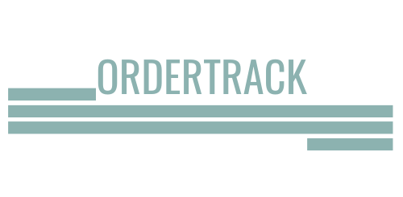

# OrderTrack - Trabalho de Conclusão de curso

OrderTrack é uma solução de software desenvolvida para a gestão eficaz de ordens de serviço, especialmente adaptada para o ambiente educacional do SENAI Suíço-Brasileira “Paulo Ernesto Tolle”.

## Sobre o Projeto

O projeto OrderTrack é uma solução de software desenvolvida para a gestão eficaz de ordens de serviço no contexto da instituição educacional SENAI Suíço-Brasileira “Paulo Ernesto Tolle”. Ele visa otimizar o processo de comunicação e acompanhamento das atividades de manutenção, proporcionando uma plataforma integrada e intuitiva para equipe, gestores e clientes.

## Objetivo

O principal objetivo do OrderTrack é melhorar a eficiência operacional e a qualidade dos serviços de manutenção oferecidos pela instituição SENAI Suíço-Brasileira “Paulo Ernesto Tolle”. Ao fornecer uma ferramenta centralizada para abertura, acompanhamento e gestão de ordens de serviço, o OrderTrack busca facilitar a comunicação entre equipe e gestores, garantindo uma resposta mais rápida às necessidades de serviço e uma maior transparência em todo o processo de manutenção.

## Funcionalidades Principais

- **Abertura de Ordem de Serviço:** Permite aos usuários criar novas ordens de serviço, inserindo detalhes como título, descrição, local, prioridade e data de entrega.
  
- **Acompanhamento de Ordem de Serviço:** Permite o acompanhamento do status de ordens de serviço em tempo real, facilitando a comunicação entre equipe, gestores e clientes.

- **Gestão de Equipe:** Oferece uma visão completa da equipe de manutenção, incluindo listagem de funcionários, atribuição de ordens de serviço e acompanhamento do desempenho individual.

- **Relatórios:** Fornece recursos analíticos para extrair insights valiosos sobre o desempenho das ordens de serviço, a eficiência operacional e a alocação de recursos.

## Como Usar

1. Faça o clone deste repositório para o seu ambiente de desenvolvimento local.
2. Abra o projeto em sua IDE preferida.
3. Execute o comando `npm install` para instalar as dependências.
4. Configure as variáveis de ambiente conforme necessário.
5. Execute o projeto utilizando o comando `npm start`.
6. Acesse a aplicação em seu navegador utilizando o endereço fornecido pela sua IDE.

## Tecnologias Utilizadas

 

